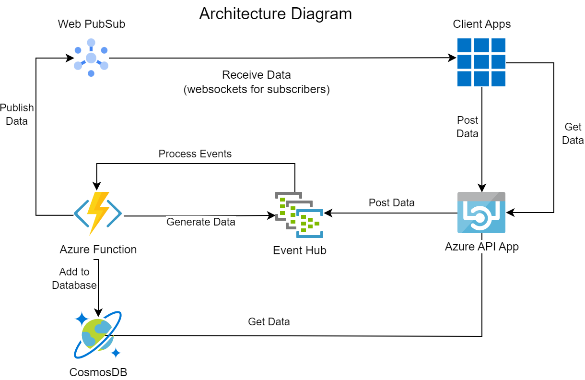

# Homework 02

- [Homework 02](#homework-02)
  - [Technologies (Azure)](#technologies-azure)
    - [Cosmos DB](#cosmos-db)
    - [Azure API App](#azure-api-app)
    - [Event Hub](#event-hub)
    - [Azure Functions](#azure-functions)
    - [Web PubSub](#web-pubsub)
    - [Client/Web Apps](#clientweb-apps)
  - [Requirements](#requirements)
    - [Components enumeration](#components-enumeration)
    - [Stateful vs Stateless](#stateful-vs-stateless)
    - [Functions as a Service (FaaS)](#functions-as-a-service-faas)
  - [System description](#system-description)
    - [Data Sources](#data-sources)
    - [Event Processor](#event-processor)
    - [Websockets / Broadcasting to users in real time](#websockets--broadcasting-to-users-in-real-time)
    - [Get/Post data](#getpost-data)
    - [CI/CD](#cicd)
    - [Stack](#stack)
  - [Architecture Diagram](#architecture-diagram)
  - [System Analysis](#system-analysis)
    - [Performance](#performance)
    - [Latency](#latency)
    - [Reliability](#reliability)
    - [Scalability](#scalability)
    - [Throughput](#throughput)
    - [Cost-effectiveness](#cost-effectiveness)

The homework is explained in [Requirements file](PCD_Homework2.txt)

## Technologies (Azure)

[Azure Stack](https://azure.microsoft.com/en-us/products/azure-stack) is a portfolio of products that extend Azure services and capabilities to your environment of choice—from the datacenter to edge locations and remote offices. Build and deploy hybrid and edge computing applications and run them consistently across location boundaries.

### Cosmos DB
[Cosmos DB](https://learn.microsoft.com/en-us/azure/cosmos-db/introduction) is a globally distributed, multi-model NoSQL database service provided by Microsoft Azure. It is designed to handle large-scale, globally distributed applications and supports a variety of data models, including document, key-value, graph, and column-family data.

Cosmos DB provides a highly scalable and highly available database service with low latency and fast throughput for mission-critical applications. It supports ACID transactions and provides multiple consistency levels, enabling developers to choose the right balance of consistency and availability for their applications.

Cosmos DB can be used for a wide range of applications, including web and mobile applications, IoT, gaming, e-commerce, and more. It supports multiple APIs, including SQL, MongoDB, Cassandra, Azure Tables, and Gremlin (for graph data). This makes it easy for developers to use the API they are most familiar with or that best fits their application's needs.

### Azure API App
[Azure API App](https://azure.microsoft.com/en-us/products/app-service/api) is a cloud-based service provided by Microsoft Azure that enables developers to quickly build, deploy, and manage RESTful APIs. It is part of the Azure App Service platform and provides a fully managed hosting environment for building and running APIs.

With Azure API App, developers can use a variety of programming languages and frameworks, including .NET, Java, Node.js, and Python, to build their APIs. They can also take advantage of features such as automatic scaling, built-in authentication and authorization, and integration with Azure services like Azure Active Directory and Azure Functions.

Azure API App also provides tools for monitoring and debugging APIs, as well as analytics and reporting capabilities to help developers understand API usage and performance. It also supports continuous deployment and integration with popular development tools like Visual Studio, GitHub, and Jenkins.

Overall, Azure API App provides a comprehensive platform for building, deploying, and managing APIs in a scalable and secure manner.

### Event Hub
[Azure Event Hub](https://learn.microsoft.com/en-us/azure/event-hubs/event-hubs-about) is a cloud-based service provided by Microsoft Azure that enables the real-time streaming of large amounts of data from various sources into the cloud. It is designed to handle high volume, low latency, and highly scalable event streams, making it ideal for scenarios such as IoT telemetry, application logging, and analytics.

With Azure Event Hub, developers can capture, process, and store large volumes of data from sources such as applications, devices, and sensors. The service can handle millions of events per second and can store events for days, weeks, or months, depending on the configuration.

Azure Event Hub provides several features to help developers manage their event streams, including partitioning, event ordering, and durable storage. It also supports integration with other Azure services such as Azure Stream Analytics, Azure Functions, and Azure Data Lake Storage, making it easy to process and analyze event data in real-time.

Overall, Azure Event Hub provides a highly scalable and reliable platform for capturing, processing, and analyzing large volumes of event data from various sources in real-time.

### Azure Functions
[Azure Functions](https://learn.microsoft.com/en-us/azure/azure-functions/functions-overview) is a serverless computing service provided by Microsoft Azure that enables developers to build and run event-driven, serverless applications in the cloud. It allows developers to focus on writing code for their application logic without having to manage the underlying infrastructure.

With Azure Functions, developers can write code in a variety of programming languages, including C#, Java, JavaScript, Python, and PowerShell. They can also choose from a variety of triggers, such as HTTP requests, timers, and messaging services like Azure Service Bus and Event Hubs. This allows them to create functions that execute in response to specific events or requests.

Azure Functions provides several features to help developers manage their serverless applications, including automatic scaling, pay-per-use pricing, and integration with other Azure services such as Azure Storage, Azure Cosmos DB, and Azure Event Grid.

Overall, Azure Functions provides a flexible and scalable platform for building and running event-driven, serverless applications in the cloud. It allows developers to focus on writing code for their application logic without having to worry about managing the underlying infrastructure.

### Web PubSub
[Azure Web PubSub](https://azure.microsoft.com/en-us/products/web-pubsub) is a cloud-based service provided by Microsoft Azure that enables real-time communication between client and server applications over websockets. It is designed to handle high-frequency, low-latency messaging scenarios, making it ideal for use cases such as real-time chat, gaming, and live broadcasting.

With Azure Web PubSub, developers can create and manage hubs, which are channels for sending and receiving messages between clients and server applications. Clients can connect to a hub using websockets and subscribe to one or more channels within the hub to receive messages.

Azure Web PubSub provides several features to help developers manage their messaging scenarios, including broadcasting messages to all connected clients, authorizing and authenticating connections, and scaling up or down the number of instances of the service based on demand.

Azure Web PubSub can integrate with other Azure services, such as Azure Functions and Azure Logic Apps, to trigger serverless functions or workflows in response to messages received by the service.

Overall, Azure Web PubSub provides a highly scalable and reliable platform for real-time communication between client and server applications over websockets. It enables developers to build real-time messaging scenarios quickly and easily without worrying about the underlying infrastructure.

### Client/Web Apps
[Azure Web Apps](https://azure.microsoft.com/en-ca/products/app-service/web) is a cloud-based service provided by Microsoft Azure that enables developers to quickly and easily build, deploy, and scale web applications in the cloud. It provides a fully managed hosting environment for web applications, allowing developers to focus on building their applications rather than managing the underlying infrastructure.

With Azure Web Apps, developers can build web applications using a variety of programming languages and frameworks, including .NET, Java, Node.js, PHP, and Python. They can also take advantage of features such as automatic scaling, built-in load balancing, and integration with Azure services such as Azure SQL Database and Azure Storage.

Azure Web Apps provides tools for monitoring and debugging web applications, as well as analytics and reporting capabilities to help developers understand application usage and performance. It also supports continuous deployment and integration with popular development tools like Visual Studio, GitHub, and Jenkins.

Overall, Azure Web Apps provides a comprehensive platform for building, deploying, and managing web applications in a scalable and secure manner. It allows developers to focus on building their applications rather than managing the underlying infrastructure, making it an ideal choice for organizations of all sizes.

## Requirements

### Components enumeration
Azure Cosmos DB, Azure Event Hub, Azure API App, Azure Functions, Azure Web PubSub, and Azure Web Apps.

### Stateful vs Stateless
Azure Cosmos DB and Azure Event Hub are stateful services, meaning they maintain a record of the state of the data that they store or process over time.

Azure Cosmos DB is a NoSQL database service that allows for multiple data models to be used and provides features such as global distribution, automatic indexing, and multiple consistency levels. It stores and manages data in a structured format and allows for data retrieval using various query methods.

Azure Event Hub is a streaming platform designed to handle large amounts of data, such as real-time event streams from IoT devices. It provides features such as partitioning, event ordering, and durable storage, allowing it to maintain the state of the data it processes over time.

On the other hand, Azure API App, Azure Functions, Azure Web PubSub, and Azure Web Apps are all stateless services, meaning they do not maintain any state of the data they process. They execute code in response to events or requests but do not store or manage data over time.

### Functions as a Service (FaaS)
Functions as a Service (FaaS), such as Azure Functions, are stateless by default, but they can also be designed to be stateful depending on the use case.

For example, a FaaS application can be designed to store state externally in a database or other storage service. This allows the function to access and update the state as needed, allowing it to maintain state across function invocations.

However, it's generally recommended to design FaaS applications as stateless to take advantage of the scalability benefits of serverless computing. By keeping the functions stateless, the provider can easily spin up new instances of the function to handle increased load without worrying about managing state across multiple instances.

## System description
The system gets data about stocks (ticks) while sending them to the users and also storing them.

### Data Sources
The Azure Function generates dummy data that is sent to Event Hub.
The client can also add data through the client app using the API.

### Event Processor
The Azure function gets triggered by new events from the Event Hub.
It processes them adding them to the database and publishing them to Web PubSub.

### Websockets / Broadcasting to users in real time
The Web PubSub service broadcasts the data received from Azure Function to
all its subscribers via websockets in real time.

### Get/Post data
Via the API you can either query all the data available or add new entries via client app.

### CI/CD
All the code written here is deployed via Github Actions to the Azure Services.

### Stack
Everything is written in .NET with several snippets of Javascript (requests, websockets, real-time table rows addition).

## Architecture Diagram

## System Analysis
When analyzing the performance of a system architecture, it is important to consider a variety of factors such as scalability, reliability, latency, throughput, and cost-effectiveness.

### Performance
Azure Cosmos DB: As a globally distributed, multi-model database service, Cosmos DB provides high availability and low latency for your data. It offers multiple consistency levels, enabling you to choose the level of data consistency that meets your application's requirements. From a performance perspective, Cosmos DB can handle high read and write loads, and it can scale horizontally to support large amounts of data.

Azure Event Hub: As a streaming platform and event ingestion service, Event Hub can handle large volumes of data in real-time. It offers features like auto-inflate and partitioning to ensure that your system can handle high data throughput. Additionally, Event Hub provides low latency event delivery and support for multiple protocols, making it a great choice for event-driven architectures.

Azure API App: This component enables you to create and expose APIs that can be used by other services or applications. From a performance perspective, API App can handle high request rates and offers features like caching and auto-scaling to ensure that your API can scale as demand increases.

Azure Functions: Functions is a serverless compute service that enables you to run code in response to events. This can be a great way to handle background tasks or to build event-driven architectures. From a performance perspective, Functions can handle high volumes of requests and can scale automatically based on demand.

Azure Web PubSub: This is a real-time messaging service that enables you to build applications with real-time messaging features. It can handle high volumes of connections and offers low latency messaging, making it a good choice for applications that require real-time communication.

Azure Web Apps: This component enables you to host and run web applications in the cloud. From a performance perspective, Web Apps can handle high traffic volumes and offers auto-scaling and load balancing features to ensure that your application can handle varying levels of demand.

Overall, this system architecture appears to be well-designed for high performance. Each component is optimized for scalability, reliability, and low latency, which are key factors for a high-performing system. Additionally, the use of serverless and managed services like Azure Functions and Cosmos DB can help reduce operational overhead and cost, making your architecture more cost-effective as well. However, it's important to continue monitoring and optimizing the performance of each component over time to ensure that the system continues to meet the requirements as your application evolves.

### Latency
When analyzing a system architecture from a latency point of view, it is important to consider the end-to-end latency of each component and the overall system. 

Azure Cosmos DB: Cosmos DB provides low latency access to your data by distributing your data across multiple regions and data centers. With Cosmos DB, you can choose the consistency level that meets your application's requirements, which can affect the overall latency. In general, Cosmos DB provides sub-millisecond read and write latencies, making it a good choice for latency-sensitive applications.

Azure Event Hub: Event Hub provides low latency event delivery and can handle high volumes of data in real-time. The exact latency depends on factors such as the size of the data payload and the network distance between the sender and the receiver, but in general, Event Hub can provide low-latency event delivery.

Azure API App: API App provides low latency access to your APIs by running your code on managed infrastructure. The exact latency depends on factors such as the complexity of your API logic and the size of the response payload, but in general, API App can provide low-latency access to your APIs.

Azure Functions: Functions provides low-latency execution of your code in response to events. The exact latency depends on factors such as the size and complexity of your code, but in general, Functions can provide low-latency execution of your code.

Azure Web PubSub: Web PubSub provides low-latency messaging capabilities for real-time communication. The exact latency depends on factors such as the network distance between the sender and the receiver and the size of the message payload, but in general, Web PubSub can provide low-latency messaging capabilities.

Azure Web Apps: Web Apps provides low-latency access to your web applications by running your code on managed infrastructure. The exact latency depends on factors such as the complexity of your application logic and the size of the response payload, but in general, Web Apps can provide low-latency access to your web applications.

Each component is optimized for low-latency access to data, APIs, and applications, which are key factors for a low-latency system. Additionally, the use of managed and serverless services like Cosmos DB and Functions can help reduce the end-to-end latency of your system by eliminating the need to manage infrastructure.

### Reliability
When analyzing a system architecture from a reliability point of view, it is important to consider the ability of each component to handle failures and ensure that the system as a whole remains available and functional.

Azure Cosmos DB: Cosmos DB provides high availability and automatic failover across multiple regions and data centers, ensuring that your data remains available even in the event of a regional or data center outage. Cosmos DB also provides automatic backups and point-in-time restore, allowing you to recover your data in the event of accidental deletion or corruption.

Azure Event Hub: Event Hub provides automatic scaling and partitioning to ensure that your system can handle high volumes of data and is resilient to failures. Event Hub also provides geo-replication and automatic failover, ensuring that your data remains available even in the event of a regional or data center outage.

Azure API App: API App runs on managed infrastructure, providing automatic scaling and load balancing to ensure that your API remains available even under high traffic loads. API App also provides automatic patching and updates, ensuring that your system remains secure and up-to-date.

Azure Functions: Functions runs on serverless infrastructure, providing automatic scaling and resource allocation to ensure that your code remains available even under high event loads. Functions also provides automatic patching and updates, ensuring that your system remains secure and up-to-date.

Azure Web PubSub: Web PubSub provides automatic scaling and load balancing to ensure that your system can handle high volumes of connections and messages. Web PubSub also provides geo-replication and automatic failover, ensuring that your system remains available even in the event of a regional or data center outage.

Azure Web Apps: Web Apps runs on managed infrastructure, providing automatic scaling and load balancing to ensure that your application remains available even under high traffic loads. Web Apps also provides automatic patching and updates, ensuring that your system remains secure and up-to-date.

Overall, your system architecture appears to be well-designed for reliability. Each component is optimized for high availability and automatic failover, ensuring that your system remains available and functional even in the event of failures or outages. Additionally, the use of managed and serverless services like Cosmos DB and Functions can help reduce the operational burden of maintaining high availability and resilience, allowing you to focus on your application logic.

### Scalability
When analyzing a system architecture from a scalability point of view, it is important to consider the ability of each component to handle increasing loads and the ability to scale the system as a whole.

Azure Cosmos DB: Cosmos DB is a highly scalable NoSQL database that can handle high volumes of reads and writes with low latency. Cosmos DB can automatically scale throughput and storage based on your application's needs, allowing you to handle increasing loads without having to worry about provisioning and managing infrastructure.

Azure Event Hub: Event Hub is a highly scalable event streaming platform that can handle high volumes of data in real-time. Event Hub can automatically scale to handle increasing volumes of data, allowing you to handle bursts of traffic without having to worry about capacity planning and management.

Azure API App: API App is a highly scalable platform for building and deploying APIs. API App can automatically scale to handle increasing traffic, allowing you to handle spikes in demand without having to worry about provisioning and managing infrastructure.

Azure Functions: Functions is a highly scalable serverless compute platform that can handle high volumes of events and execute your code on-demand. Functions can automatically scale to handle increasing event volumes, allowing you to handle bursts of traffic without having to worry about capacity planning and management.

Azure Web PubSub: Web PubSub is a highly scalable real-time messaging platform that can handle high volumes of connections and messages. Web PubSub can automatically scale to handle increasing traffic, allowing you to handle spikes in demand without having to worry about capacity planning and management.

Azure Web Apps: Web Apps is a highly scalable platform for building and deploying web applications. Web Apps can automatically scale to handle increasing traffic, allowing you to handle spikes in demand without having to worry about provisioning and managing infrastructure.

Each component is optimized for automatic scaling, allowing you to handle increasing loads without having to worry about capacity planning and management. Additionally, the use of managed and serverless services like Cosmos DB and Functions can help reduce the operational burden of scaling, allowing you to focus on your application logic.

### Throughput
When analyzing a system architecture from a throughput point of view, it is important to consider the ability of each component to handle and process a high volume of requests and data in a timely manner. 

Azure Cosmos DB: Cosmos DB is a high-performance NoSQL database that can handle high volumes of reads and writes with low latency. Cosmos DB uses a globally distributed architecture and provides automatic scaling of throughput and storage based on your application's needs. This allows you to handle large volumes of data and requests with low latency.

Azure Event Hub: Event Hub is a high-throughput event streaming platform that can handle high volumes of data in real-time. Event Hub uses partitioning and provides automatic scaling to handle increasing volumes of data. This allows you to handle large volumes of data with low latency.

Azure API App: API App is a high-performance platform for building and deploying APIs. API App uses managed infrastructure and provides automatic scaling of resources to handle high volumes of requests. This allows you to handle large volumes of requests with low latency.

Azure Functions: Functions is a high-performance serverless compute platform that can handle high volumes of events and execute your code on-demand. Functions uses a pay-per-execution model and provides automatic scaling of resources to handle high volumes of events. This allows you to handle large volumes of events with low latency.

Azure Web PubSub: Web PubSub is a high-throughput real-time messaging platform that can handle high volumes of connections and messages. Web PubSub uses WebSockets and provides automatic scaling of resources to handle high volumes of traffic. This allows you to handle large volumes of traffic with low latency.

Azure Web Apps: Web Apps is a high-performance platform for building and deploying web applications. Web Apps uses managed infrastructure and provides automatic scaling of resources to handle high volumes of traffic. This allows you to handle large volumes of traffic with low latency.

Each component is optimized for high performance and automatic scaling, allowing you to handle high volumes of requests, data, and traffic with low latency. Additionally, the use of managed and serverless services like Cosmos DB and Functions can help reduce the operational burden of handling high throughput, allowing you to focus on your application logic. 

### Cost-effectiveness
When analyzing a system architecture from a cost-effectiveness point of view, it is important to consider the cost of each component and how they contribute to the overall cost of the system.

Azure Cosmos DB: Cosmos DB is a managed NoSQL database that can be expensive for high levels of throughput and storage. However, Cosmos DB provides automatic scaling of throughput and storage based on your application's needs, which can help reduce costs by eliminating the need to provision and manage infrastructure.

Azure Event Hub: Event Hub is a managed event streaming platform that can be cost-effective for high volumes of data, as it uses a pay-as-you-go pricing model based on the number of events. Event Hub also provides automatic scaling to handle increasing volumes of data, which can help reduce costs by only paying for the resources you need.

Azure API App: API App is a managed platform for building and deploying APIs that can be cost-effective for small to medium workloads. However, for high volumes of traffic, the cost can increase due to the need for additional resources. Automatic scaling can help reduce costs by only paying for the resources you need.

Azure Functions: Functions is a serverless compute platform that can be cost-effective for small to medium workloads, as you only pay for the resources used when your code is executed. However, for high volumes of events, the cost can increase due to the need for additional resources. Automatic scaling can help reduce costs by only paying for the resources you need.

Azure Web PubSub: Web PubSub is a managed real-time messaging platform that can be cost-effective for small to medium workloads. However, for high volumes of traffic, the cost can increase due to the need for additional resources. Automatic scaling can help reduce costs by only paying for the resources you need.

Azure Web Apps: Web Apps is a managed platform for building and deploying web applications that can be cost-effective for small to medium workloads. However, for high volumes of traffic, the cost can increase due to the need for additional resources. Automatic scaling can help reduce costs by only paying for the resources you need.

The system architecture is designed for cost-effectiveness, as it uses a mix of managed and serverless services that can help reduce costs by only paying for the resources you need. 
