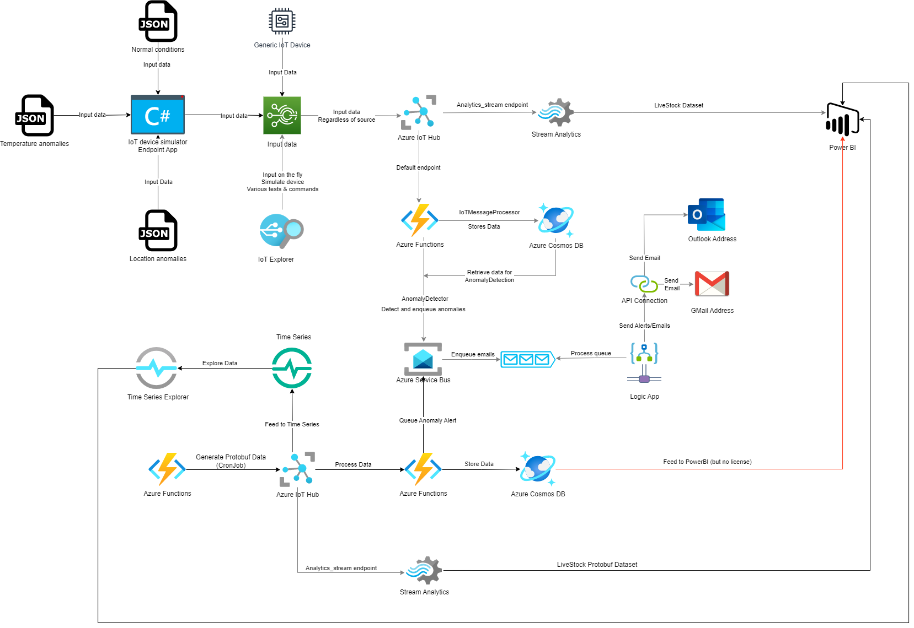

# Homework 03

The homework requirements are explained in [Requirements file](PCD_Homework3.txt)

- [Homework 03](#homework-03)
- [Proposals (10 examples using Azure Cloud)](#proposals-10-examples-using-azure-cloud)
  - [Smart Irrigation System](#smart-irrigation-system)
  - [Autonomous Crop Monitoring System](#autonomous-crop-monitoring-system)
  - [Livestock Monitoring System](#livestock-monitoring-system)
  - [Precision Farming System](#precision-farming-system)
  - [Crop Yield Prediction System](#crop-yield-prediction-system)
  - [Supply Chain Management System](#supply-chain-management-system)
  - [Environmental Monitoring System](#environmental-monitoring-system)
  - [Plant Disease Detection System](#plant-disease-detection-system)
  - [Farm Equipment Monitoring System](#farm-equipment-monitoring-system)
  - [Agrochemical Management System](#agrochemical-management-system)
- [Easiest to implement (2 examples from 10 above)](#easiest-to-implement-2-examples-from-10-above)
  - [Livestock Monitoring System](#livestock-monitoring-system-1)
  - [Environmental Monitoring System](#environmental-monitoring-system-1)
- [Hardest to implement (2 examples from 10 above)](#hardest-to-implement-2-examples-from-10-above)
  - [Autonomous Crop Monitoring System](#autonomous-crop-monitoring-system-1)
  - [Supply Chain Management System](#supply-chain-management-system-1)
- [A more detailed explanation for the simplest 2 examples](#a-more-detailed-explanation-for-the-simplest-2-examples)
  - [Livestock Monitoring System](#livestock-monitoring-system-2)
  - [Environmental Monitoring System](#environmental-monitoring-system-2)
- [Architecture diagrams](#architecture-diagrams)
  - [Livestock Monitoring System (easy)](#livestock-monitoring-system-easy)
  - [Environmental Monitoring System (easy)](#environmental-monitoring-system-easy)
  - [Precision Agriculture System (difficult)](#precision-agriculture-system-difficult)
  - [Smart Irrigation System (difficult)](#smart-irrigation-system-difficult)
- [Examples of IoT data](#examples-of-iot-data)
  - [Livestock Monitoring System](#livestock-monitoring-system-3)
  - [Environmental Monitoring System](#environmental-monitoring-system-3)
- [Protobuf](#protobuf)
  - [How would you use this Protobuf template to generate a .NET class?](#how-would-you-use-this-protobuf-template-to-generate-a-net-class)
  - [Why would you store Protobufs in an Azure database?](#why-would-you-store-protobufs-in-an-azure-database)
  - [Protobuf template for the Environmental Monitoring System data](#protobuf-template-for-the-environmental-monitoring-system-data)
  - [Protobuf template for the Livestock Monitoring System data](#protobuf-template-for-the-livestock-monitoring-system-data)
- [Technologies](#technologies)
  - [Environmental Monitoring System](#environmental-monitoring-system-4)
  - [Livestock Monitoring System](#livestock-monitoring-system-4)
  - [Cost Comparison](#cost-comparison)
- [Architecture - Livestock Monitoring System](#architecture---livestock-monitoring-system)
- [Bibliography](#bibliography)

# Proposals (10 examples using Azure Cloud)

## Smart Irrigation System
Azure Cloud may be used to create a smart irrigation system utilizing Azure IoT Hub and Azure Stream Analytics. Real-time data on soil moisture, weather, and plant water use can be gathered by the system using IoT sensors. To ascertain crop water requirements and create individualized irrigation schedules, the data gathered can be processed and analyzed using Azure Stream Analytics. Additionally, based on the data analysis, the system can automate irrigation control using Azure Functions, improving crop yields and water efficiency.

## Autonomous Crop Monitoring System
An autonomous agricultural monitoring system can be created utilizing Azure Cloud and Azure Cognitive Services and Azure IoT Edge. Drones with cameras and sensors can be used by the system to gather information on weather patterns, crop health, and soil conditions. With Azure IoT Edge, the drone can process and analyze the data collected locally before sending it to Azure Cognitive Services for additional analysis. Images captured by the drones may be analyzed using Azure Cognitive Services to spot pests or diseases that affect plants. A treatment plan that is unique to each plant or plot can subsequently be constructed using the information provided.

## Livestock Monitoring System
A system for monitoring cattle can be created using Azure IoT Hub and Azure Functions. The system can gather current information on animal health, behavior, and location via IoT sensors. Azure Functions may evaluate this data to look for anomalies and notify farmers of any health problems.

## Precision Farming System
A precision farming system can be created using Azure IoT Hub and Azure Machine Learning. Real-time data on soil moisture, nutrient levels, and weather conditions can be gathered by the system using IoT sensors. Azure Machine Learning may be used to analyze this data and create unique fertilization and irrigation schedules for each crop or field.

## Crop Yield Prediction System
A crop yield forecast system can be created using Azure Databricks and Azure Machine Learning. The system can forecast agricultural yield for each field using previous weather information, crop growth information, and other pertinent data. Farmers can use this information to utilize it to make well-informed decisions about crop management and harvesting.

## Supply Chain Management System
A supply chain management system for agricultural can be created using Azure Blockchain and Azure Functions. The system can trace and confirm the provenance and caliber of each crop using blockchain technology. Automation of procedures such as payment and inventory management is possible with Azure Functions.

## Environmental Monitoring System
A system for environmental monitoring can be created using Azure IoT Hub and Azure Time Series Insights. Real-time data on weather, water quality, and air quality can be collected by the system using IoT sensors. Azure Time Series Insights may be used to evaluate this data and find any potential environmental risks or dangers.

## Plant Disease Detection System
It is possible to create a plant disease detection system using Azure Cognitive Services and Azure Functions. The device can recognize any indications of plant disease or pest infestation using picture recognition technology. Depending on the identified disease or pest, the treatment process can be automated using Azure Functions.

## Farm Equipment Monitoring System
A monitoring system for farm equipment can be created using Azure Event Grid and Azure IoT Hub. IoT sensors can be used by the system to gather real-time information on the location, use, and health of the equipment. Azure Event Grid can be used to analyze this data in order to find any potential equipment faults and notify farmers.

## Agrochemical Management System
Building an agrochemical management system can make use of Azure Cognitive Services and Azure Functions. The device can determine the kinds and amounts of agrochemicals used in each field using picture recognition technology. According on the specified demands, agrochemical ordering and delivery can be automated using Azure Functions.

# Easiest to implement (2 examples from 10 above)

## Livestock Monitoring System
Since the livestock monitoring system only needs simple IoT sensors to capture real-time data on animal health, activity, and location, it is relatively simple to set up and less expensive. Azure Functions, a serverless compute solution that only charges for the amount of processing power utilized and reduces expenses, can be used to process and analyze this data.

## Environmental Monitoring System
Since the environmental monitoring system only needs simple IoT sensors to gather real-time data on weather, water quality, and air quality, it is also relatively simple to set up and less expensive. Azure Time Series Insights is a fully managed analytics, storage, and visualization service that can be used to analyze this data at a lower cost because it only charges for the quantity of data that is saved and queried.

# Hardest to implement (2 examples from 10 above)

## Autonomous Crop Monitoring System
Drones with cameras and sensors are used as part of the autonomous crop monitoring system to gather information on crop health, soil conditions, and weather patterns. The creation of specialist hardware and software may be necessary for this system's implementation, which can be expensive. Also, it can cost more to handle and analyze the data gathered with Azure Cognitive Services.

## Supply Chain Management System
Blockchain technology is used in the supply chain management system to trace and confirm the provenance and caliber of each crop. This system's implementation might call for specialist blockchain development and system integration, which might be difficult and pricey. However, employing Azure Functions to automate procedures like payment and inventory management may increase the price.

# A more detailed explanation for the simplest 2 examples

## Livestock Monitoring System
IoT sensors are used in the livestock monitoring system to gather current information on animal health, behavior, and location. Animals can have these sensors attached to them, and they can detect things like activity levels, heart rates, and body temperatures. The Azure IoT Hub, a fully managed cloud service that enables safe and dependable connectivity between IoT devices and other Azure services, receives this data after it has been sent elsewhere. The data may then be processed and analyzed using Azure Functions, a serverless compute solution that only bills for the processing power actually used. IoT device telemetry can be utilized to trigger code in Azure Functions, enabling real-time data processing and analysis. Using Power BI, a business analytics application that offers interactive data visualization tools, the examined data can then be viewed and tracked. Power BI is accessible for a number of use cases because it has both a free version and more sophisticated commercial editions.
Overall, because it just requires basic IoT sensors and makes use of fully managed services like IoT Hub and Azure Functions, the livestock monitoring system can be implemented using Azure Cloud in a reasonably simple and affordable manner.

## Environmental Monitoring System
IoT sensors are used in the environmental monitoring system to gather real-time data on weather, water quality, and air quality. These sensors can monitor variables including temperature, humidity, air pressure, and pollution levels and can be installed in a variety of places. The Azure IoT Hub receives this data after which Azure Time Series Insights can process and analyze it. A fully managed analytics, storage, and visualization service, Azure Time Series Insights bases its fees on the volume of data stored and queried. It is perfect for applications requiring the storage and analysis of significant amounts of time-stamped data, such as environmental monitoring. Real-time monitoring and analysis are then possible using Power BI or other custom dashboards to visualize the analyzed data.
Overall, because it just requires basic IoT sensors and makes use of fully managed services like IoT Hub and Azure Time Series Insights, the environmental monitoring system can be implemented using Azure Cloud in a reasonably simple and affordable manner.

# Architecture diagrams

## Livestock Monitoring System (easy)

    +---------------------------------------+
    |            IoT Sensors                |
    |         (temperature, heart rate,     |
    |          activity levels, etc.)       |
    +----------------+----------------------+
                     |
                     | HTTP
                     |
    +----------------+----------------------+
    |            Azure IoT Hub              |
    |     (data ingestion and routing)      |
    +----------------+----------------------+
                     |
                     | HTTP/Event Grid
                     |
    +-----------------+---------------------+
    |            Azure Functions            |
    |      (data processing and analysis)   |
    +-----------------+---------------------+
                     |
                     | REST
                     |
    +-----------------+---------------------+
    |            Power BI                   |
    |   (data visualization and monitoring) |
    +---------------------------------------+

## Environmental Monitoring System (easy)

     +---------------------------------------+
     |             IoT Sensors               |
     |  (temperature, humidity, air quality, |
     |          weather conditions, etc.)    |
     +----------------+----------------------+
                      |
                      | HTTP
                      |
    +-----------------+----------------------+
    |            Azure IoT Hub               |
    |     (data ingestion and routing)       |
    +-----------------+----------------------+
                      |
                      | REST
                      |
    +-----------------+----------------------+
    |      Azure Time Series Insights        |
    |  (data storage, analysis and querying) |
    +-----------------+----------------------+
                      |
                      | REST
                      |
    +-----------------+----------------------+
    |            Power BI                    |
    |    (data visualization and monitoring) |
    +----------------------------------------+

## Precision Agriculture System (difficult)

    +---------------------------------------+
    |            IoT Sensors                |
    |     (soil moisture, temperature,      |
    |    humidity, light levels, etc.)      |
    +----------------+----------------------+
                     |
                     | HTTP
                     |
    +----------------+----------------------+
    |            Azure IoT Hub              |
    |     (data ingestion and routing)      |
    +----------------+----------------------+
                     |
                     | HTTP
                     |
    +-----------------+---------------------+
    |            Azure Stream Analytics     |
    |    (data processing and real-time     |
    |              analytics)               |
    +-----------------+---------------------+
                     |
                     | REST/Event Grid
                     |
    +-----------------+---------------------+
    |      Azure Machine Learning Service   |
    |     (training and deployment of ML    |
    |            models)                    |
    +-----------------+---------------------+
                     |
                     | REST
                     |
    +-----------------+---------------------+
    |      Azure Functions                  |
    |  (data processing, workflow management|
    |            and automation)            |
    +-----------------+---------------------+
                     |
                     | REST/Event Grid
                     |
    +-----------------+---------------------+
    |            Power BI                   |
    |    (data visualization and monitoring)|
    +---------------------------------------+

## Smart Irrigation System (difficult)

     +---------------------------------------+
     |             IoT Sensors               |
     |   (soil moisture, weather conditions, |
     |          water flow rates, etc.)      |
     +----------------+----------------------+
                      |
                      | HTTP
                      |
    +-----------------+----------------------+
    |            Azure IoT Hub               |
    |     (data ingestion and routing)       |
    +-----------------+----------------------+
                      |
                      | REST
                      |
    +-----------------+----------------------+
    |       Azure Time Series Insights       |
    | (data storage, analysis and querying)  |
    +-----------------+----------------------+
                      |
                      | REST/Event Grid
                      |
    +-----------------+----------------------+
    |      Azure Machine Learning Service    |
    |     (training and deployment of ML     |
    |              models)                   |
    +-----------------+----------------------+
                      |
                      | REST/Event Grid
                      |
    +-----------------+----------------------+
    |            Azure Functions             |
    |  (data processing, workflow management |
    |            and automation)             |
    +-----------------+----------------------+
                      |
                      | REST
                      |
    +-----------------+----------------------+
    |            Power BI                    |
    |    (data visualization and monitoring) |
    +----------------------------------------+

# Examples of IoT data

## Livestock Monitoring System

    {
      "animal_id": "A123",
      "body_temperature": 39.2,
      "activity_level": 8,
      "heart_rate": 72,
      "respiration_rate": 14,
      "location": {
        "latitude": 37.7749,
        "longitude": -122.4194
      },
      "feed_intake": 4.5,
      "water_consumption": 15,
      "milk_production": 12.5,
      "weight": 450
    }

## Environmental Monitoring System

    {
      "sensor_id": "S123",
      "temperature": 22.1,
      "humidity": 54.3,
      "co2_level": 1280,
      "particulate_matter": 10,
      "soil_moisture": 32,
      "light_level": 2300,
      "wind_speed": 5.3,
      "wind_direction": 270,
      "precipitation": 0,
      "water_quality": {
        "ph_level": 7.2,
        "dissolved_oxygen": 7.5
      },
      "noise_level": 45
    }

# Protobuf

## How would you use this Protobuf template to generate a .NET class?

To generate a .NET class from the Protobuf template, you can use the protoc compiler along with the C# plugin. Here are the steps to generate the .NET class:

Install the protobuf compiler and the C# plugin. You can follow the instructions in the official Protobuf documentation to download and install these tools.

Create a .proto file that includes the Protobuf template. You can save the template in a file named environmental_data.proto.

Run the following command to generate the .NET class:

    protoc --csharp_out=. environmental_data.proto

This command generates a C# class file named environmental_data.cs in the current directory.

Use the generated C# class in your .NET application to encode and decode data using the Protobuf format.

## Why would you store Protobufs in an Azure database?

The answer is that you can store protobufs in any Azure database that accepts binary data, including Azure Data Lake Storage, Azure Blob Storage, and Azure Cosmos DB. The following are some justifications for why Protobufs could be best kept in an Azure database:

- Efficient storage and retrieval

      Protobufs are binary data that are designed to be compact and efficient, which means that they can take up less storage space and be retrieved faster than equivalent JSON or XML data. By storing Protobufs in an Azure database, you can take advantage of the optimized storage and retrieval capabilities of the database to efficiently store and retrieve large amounts of data.

- Interoperability
  
      Programming languages like C++, Java, Python, and C# can all use protobufs, a language- and platform-independent format, to describe data. You may facilitate interoperability across various applications and systems that utilize various programming languages and platforms by storing Protobufs in an Azure database.

- Compatibility with cloud services

      Protobufs is a supported data format by many Azure cloud services, including Azure Event Hubs and Azure Stream Analytics. You may quickly link your data with these cloud services and benefit from their data processing and analytics capabilities by storing Protobufs in an Azure database.

- Schema evolution

      Schema evolution is supported by protobufs, allowing you to alter the data's structure over time without jeopardizing compatibility with earlier versions of the data. You can benefit from this functionality to adapt your data schema over time as your application and business demands change by storing Protobufs in an Azure database.

Overall, Protobufs storage in an Azure database can offer your application a variety of advantages, including as effective storage and retrieval, interoperability, compatibility with cloud services, and schema evolution.

## Protobuf template for the Environmental Monitoring System data

    syntax = "proto3";
    
    message EnvironmentalData {
      message Temperature {
        float value = 1;
        string unit = 2;
      }
    
      message Humidity {
        float value = 1;
        string unit = 2;
      }
    
      message Pressure {
        float value = 1;
        string unit = 2;
      }
    
      message Wind {
        float speed = 1;
        float direction = 2;
        string unit = 3;
      }
    
      message DateTime {
        int64 timestamp = 1;
        string timezone = 2;
      }
    
      message Location {
        float latitude = 1;
        float longitude = 2;
      }
    
      Temperature temperature = 1;
      Humidity humidity = 2;
      Pressure pressure = 3;
      Wind wind = 4;
      DateTime datetime = 5;
      Location location = 6;
    }

## Protobuf template for the Livestock Monitoring System data

    syntax = "proto3";
    
    package livestock;
    
    message SensorReading {
      string sensor_id = 1;
      double body_temperature = 2;
      int32 activity_level = 3;
      double heart_rate = 4;
      double respiration_rate = 5;
      int64 timestamp = 6;
      string animal_id = 7;
    }
    
    message AnimalLocation {
      string animal_id = 1;
      double latitude = 2;
      double longitude = 3;
      int64 timestamp = 4;
    }
    
    message FeedIntake {
      string animal_id = 1;
      double amount = 2;
      int64 timestamp = 3;
    }
    
    message WaterConsumption {
      string animal_id = 1;
      double amount = 2;
      int64 timestamp = 3;
    }
    
    message MilkProduction {
      string animal_id = 1;
      double amount = 2;
      int64 timestamp = 3;
    }
    
    message AnimalWeight {
      string animal_id = 1;
      double weight = 2;
      int64 timestamp = 3;
    }

This template defines six message types:

SensorReading: Represents a reading from a sensor attached to an animal. The message contains the ID of the sensor, the body temperature, activity level, heart rate, respiration rate, timestamp, and the ID of the animal.

AnimalLocation: Represents the current location of an animal. The message contains the ID of the animal, the latitude and longitude coordinates, and the timestamp.

FeedIntake: Represents the amount of feed consumed by an animal. The message contains the ID of the animal, the amount of feed consumed, and the timestamp.

WaterConsumption: Represents the amount of water consumed by an animal. The message contains the ID of the animal, the amount of water consumed, and the timestamp.

MilkProduction: Represents the amount of milk produced by a lactating animal. The message contains the ID of the animal, the amount of milk produced, and the timestamp.

AnimalWeight: Represents the weight of an animal. The message contains the ID of the animal, the weight, and the timestamp.

# Technologies

## Environmental Monitoring System

There are several Azure technologies that can be involved in an Environmental Monitoring System, depending on the specific needs and requirements of the system. Some possible examples include:

Azure IoT Hub: to receive and process data from various sensors and devices installed in the environment, such as temperature, humidity, air quality, water quality, or noise level sensors.

Azure Stream Analytics: to analyze real-time data streams from the sensors and devices and extract insights such as trends, patterns, or anomalies.

Azure Functions: to trigger custom logic in response to specific events or conditions in the system, such as sending alerts or notifications to users, or triggering automated actions based on certain data patterns.

Azure Cosmos DB: to store and manage large volumes of data from the sensors and devices, with features such as high availability, low latency, and flexible querying.

Azure Maps: to visualize the data from the sensors and devices on maps and geospatial visualizations, and to provide location-based services such as routing, geocoding, or geofencing.

Azure Machine Learning: to build predictive models or machine learning algorithms that can detect early signs of environmental risks or predict future trends based on historical data.

Azure Virtual Machines: to run software applications or services that require a dedicated, customizable environment, such as a dashboard or a monitoring system that visualizes the data from the sensors and devices.

Azure Active Directory: to manage user access and permissions to the Environmental Monitoring System, with features such as multi-factor authentication, single sign-on, and identity protection.

## Livestock Monitoring System

Azure IoT Hub: to receive and process data from IoT devices attached to the livestock, and to send commands and alerts back to those devices.

Azure Stream Analytics: to analyze real-time data streams from the IoT devices and extract insights such as anomalies, trends, or correlations.

Azure Functions: to trigger custom logic in response to specific events or conditions in the system, such as sending notifications to farmers or triggering automated actions based on certain data patterns.

Azure Cosmos DB: to store and manage large volumes of data from the IoT devices, with features such as high availability, low latency, and flexible querying.

Azure Machine Learning: to build predictive models or machine learning algorithms that can detect early signs of diseases or predict future growth and productivity of the livestock based on historical data.

Azure Virtual Machines: to run software applications or services that require a dedicated, customizable environment, such as a dashboard or a monitoring system that visualizes the data from the IoT devices.

Azure Active Directory: to manage user access and permissions to the Livestock Monitoring System, with features such as multi-factor authentication, single sign-on, and identity protection.

## Cost Comparison

Due to the requirement for more specific technology and sensors for monitoring the many physiological characteristics of the animals, the Livestock Monitoring System would probably be more expensive to construct than the Environmental Monitoring System.

Some of the most expensive Azure technologies would depend on how they were implemented and what the system needed. The cost of the IoT Hub would be a major consideration, for instance, if the Livestock Monitoring System needed to use Azure IoT Hub to gather and analyse data from hundreds of sensors mounted to the animals. Similar to this, the cost of the Stream Analytics service would be a major consideration if the Environmental Monitoring System needed the usage of Azure Stream Analytics for processing huge volumes of real-time data from numerous sources.

Nevertheless, generally speaking, some of the most expensive Azure technologies include applications like Azure Machine Learning, Azure Data Lake Storage, and Azure Cosmos DB that demand a lot of computation or storage. For some use situations, these services can offer a lot of value, but they might also be more expensive.

# Architecture - Livestock Monitoring System

# Bibliography
[Synthetic Data Generation for the Internet of Things](https://tigerprints.clemson.edu/cgi/viewcontent.cgi?article=1035&context=computing_pubs)

[IoSynth - IoT device/sensor simulator and synthetic data generator](https://github.com/rradev/iosynth)